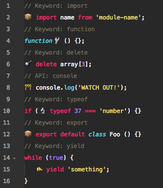
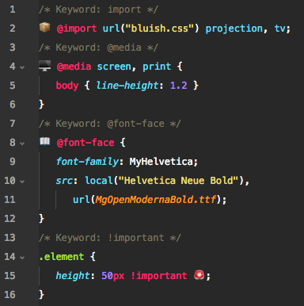
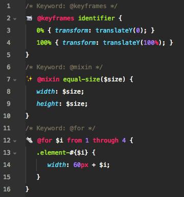

# Emoji Syntax

Getting bored of your code? Already tried out hundreds of syntax highlighter but always felt something is missing?

**Emoji Syntax is what you need!**

An atom package adding emoji to language keywords.

## :microphone: Supported languages

JavaScript `.js` | CSS `.css`
---------- | --- | ----
 | 
**Sass `.scss, .sass`** |
 |

### In progress
- PHP `.php`

## :fire: Features

- Change existing keywords with *any* emoji you want
- Define position of the emoji around a keyword
- Add or remove spacing
- Disable entire languages

## :wrench: Settings

_You can display the project's emoji settings through the `Emoji Syntax: Settings` command from the command palette or `Packages` menu._

#### Strict Emoji Mode
_Default: `true`_

If enabled it is only allowed to use a valid emoji unicode and not any other character.

## :clipboard: Planned

- All languages
- Code preview of keywords in settings view
- Set to default option per language
- Settings view should stay active when reloading editor

Do you have a feature request? Just open an issue here on Github!

## :copyright: License
The code is available under [MIT License](https://github.com/morkro/atom-emoji-syntax/blob/master/LICENSE.md).
